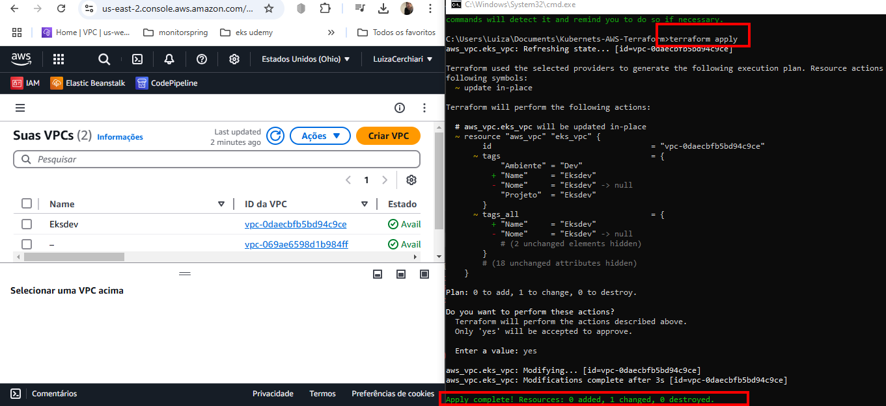

# 1 Strategy AWS VPC 

Project made based on AWS documentation:

[EKS userguide docs](https://docs.aws.amazon.com/eks/latest/userguide/network-reqs.html#network-requirements-vpc)

## Requirements

| Nome | Versão |
|------|---------|
| <a name="requirement_aws"></a> [aws](#requirement\_aws) | > 4.47.0 |
 |
| <a name="requirement_kubernetes"></a> [kubernetes](#requirement\_kubernetes) | > 2.10.0 |


| Location   | AWS Region | IP CIDR       | Address Range               |
|------------|------------|---------------|-----------------------------|
| Ohio       | us-east-2  | 10.0.0.0/10   | 10.0.0.1 - 10.63.255.255    | |


````
terraform init
terraform plan
terraform apply
````


## Example 
  
